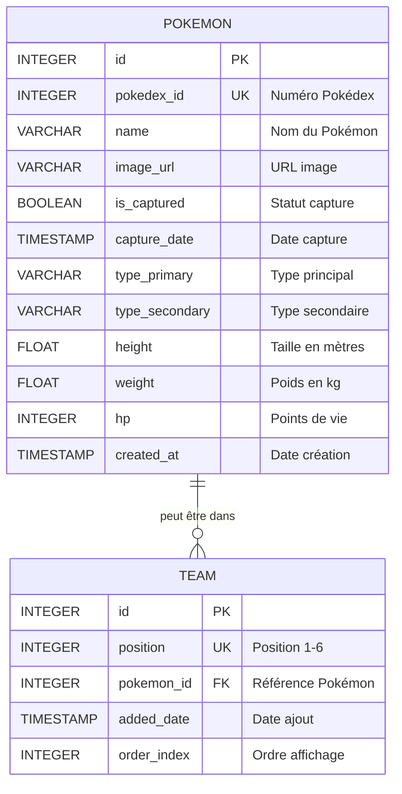

# 🎮 Pokédex Electron

<div align="center">
  
  **Une application de bureau complète pour capturer, gérer et collectionner vos Pokémons préférés**
  
  [](https://jestjs.io/)
  [](https://electronjs.org/)
  [](LICENSE)
</div>

---

## 📋 Table des matières

- [À propos](#à-propos)
- [Fonctionnalités](#fonctionnalités)
- [Architecture](#architecture)
- [Installation](#installation)
- [Utilisation](#utilisation)
- [Sécurité](#sécurité)
- [Tests](#tests)
- [CI/CD](#cicd)
- [Packaging](#packaging)
- [Documentation](#documentation)
- [License](#license)

---

## 🎯 À propos

**Pokédex Electron** est une application de bureau moderne développée avec **Electron**, permettant aux fans de Pokémon de :
- 📚 Consulter un Pokédex complet avec tous les Pokémons
- 🎯 Capturer des Pokémons via un système de clicker intuitif
- ⚔️ Constituer une équipe stratégique de 6 Pokémons
- 💾 Sauvegarder localement toutes leurs données

### Pourquoi ce projet ?

Ce projet a été développé dans le cadre d'un cours sur Electron, avec les objectifs suivants :
- ✅ Maîtriser l'architecture multi-processus d'Electron
- ✅ Implémenter une persistance locale avec SQLite
- ✅ Consommer une API REST (PokéAPI)
- ✅ Appliquer les bonnes pratiques de sécurité
- ✅ Mettre en place une CI/CD complète

---

## ✨ Fonctionnalités

### 🗂️ Pokédex Complet
- Visualisation de **tous les Pokémons** disponibles
- Filtrage par statut (capturé / non capturé)
- Fiche détaillée avec statistiques, types, poids et taille
- Interface responsive et moderne

### 🎯 Système de Capture
- **Mode clicker** : cliquez pour infliger des dégâts
- Système de **PV basé sur les stats réelles** des Pokémons
- **Coups critiques** (3% de chance) avec effet d'éclair
- **Pokéball rare** (10% de chance) pour capture instantanée
- Animation fluide de capture

### ⚔️ Gestion d'Équipe
- Constitution d'une **équipe de 6 Pokémons**
- **Drag & Drop** intuitif pour organiser l'équipe
- Bonus de dégâts : **+1 dégât par Pokémon en équipe**
- Sauvegarde automatique avec confirmation

### 💾 Persistance Locale
- Base de données **SQLite** embarquée
- Synchronisation avec **PokéAPI**
- Sauvegarde automatique de la progression
- Gestion robuste des erreurs

---

## 🏗️ Architecture

### Architecture Multi-Processus

```
┌─────────────────────────────────────────────────────────┐
│                    MAIN PROCESS                          │
│  ┌────────────────────────────────────────────────┐     │
│  │  main.js                                        │     │
│  │  - Création de la fenêtre                       │     │
│  │  - Gestion du cycle de vie                      │     │
│  │  - IPC Handlers                                 │     │
│  └──────────────┬──────────────────────────────────┘     │
│                 │                                          │
│  ┌──────────────▼──────────────┐  ┌─────────────────┐    │
│  │  database.js                 │  │  api-service.js │    │
│  │  - CRUD Operations           │  │  - PokéAPI      │    │
│  │  - SQLite3                   │  │  - Fetch        │    │
│  └──────────────────────────────┘  └─────────────────┘    │
└─────────────────────┬───────────────────────────────────┘
                      │ IPC (contextBridge)
                      │
┌─────────────────────▼───────────────────────────────────┐
│                 PRELOAD SCRIPT                           │
│  ┌────────────────────────────────────────────────┐     │
│  │  preload.js                                     │     │
│  │  - contextBridge.exposeInMainWorld()            │     │
│  │  - API sécurisée exposée au renderer            │     │
│  │  - Validation des paramètres                    │     │
│  └────────────────────────────────────────────────┘     │
└─────────────────────┬───────────────────────────────────┘
                      │
┌─────────────────────▼───────────────────────────────────┐
│                 RENDERER PROCESS                         │
│  ┌────────────────────────────────────────────────┐     │
│  │  index.html + styles.css                        │     │
│  │  ┌──────────┐  ┌──────────┐  ┌──────────┐      │     │
│  │  │ home.js  │  │pokedex.js│  │capture.js│      │     │
│  │  └──────────┘  └──────────┘  └──────────┘      │     │
│  │  ┌──────────┐  ┌──────────────────────┐        │     │
│  │  │ team.js  │  │  renderer.js         │        │     │
│  │  └──────────┘  └──────────────────────┘        │     │
│  └────────────────────────────────────────────────┘     │
└─────────────────────────────────────────────────────────┘
```

### Organisation des fichiers

```
Pokedex/
├── src/
│   ├── main/
│   │   ├── main.js           # Point d'entrée, création fenêtre
│   │   ├── database.js       # Gestion SQLite
│   │   └── api-service.js    # Communication avec PokéAPI
│   ├── preload.js            # Bridge sécurisé Main ↔ Renderer
│   ├── renderer/
│   │   ├── index.html        # Interface principale
│   │   ├── css/
│   │   │   └── styles.css    # Styles globaux
│   │   └── js/
│   │       ├── renderer.js   # Logique globale
│   │       ├── home.js       # Page d'accueil
│   │       ├── pokedex.js    # Pokédex
│   │       ├── team.js       # Gestion équipe
│   │       └── capture.js    # Système de capture
│   └── assets/               # Images et ressources
├── tests/                    # Tests Jest
├── docs/                     # Documentation technique
├── .github/workflows/        # CI/CD GitHub Actions
└── package.json
```

### 📊 Schéma de Base de Données

L'application utilise **SQLite** comme base de données relationnelle embarquée pour stocker les Pokémons et la composition de l'équipe.

**Localisation** : `%AppData%/pokedex-electron/pokedex.db`



**Relations** :
- Un Pokémon peut être dans l'équipe (0 ou 1 fois)
- Une position de l'équipe contient 0 ou 1 Pokémon
- L'équipe est limitée à 6 positions maximum

**Requêtes principales** :
```sql
-- Récupérer tous les Pokémons capturés
SELECT * FROM pokemon WHERE is_captured = 1 ORDER BY name;

-- Récupérer l'équipe complète avec détails
SELECT t.position, p.* FROM team t
LEFT JOIN pokemon p ON t.pokemon_id = p.id
ORDER BY t.position;

-- Capturer un Pokémon
UPDATE pokemon 
SET is_captured = 1, capture_date = CURRENT_TIMESTAMP 
WHERE id = ?;
```

---

## 🚀 Installation

### Prérequis

- **Node.js** >= 18.x
- **npm** >= 9.x
- **Git**

### Installation des dépendances

```bash
# Cloner le repository
git clone https://github.com/votre-username/pokedex-electron.git
cd pokedex-electron

# Installer les dépendances
npm install
```

---

## 💻 Utilisation

### Mode Développement

```bash
npm start
```

### Lancer les tests

```bash
npm test
```

### Build de production

```bash
# Build pour Windows
npm run build:win

# Build pour macOS
npm run build:mac

# Build pour Linux
npm run build:linux

# Build pour toutes les plateformes
npm run build
```

Les exécutables seront générés dans le dossier `dist/`.

---

## 🔒 Sécurité

### Bonnes pratiques implémentées

#### 1. **contextIsolation: true**
```javascript
webPreferences: {
  contextIsolation: true  // Isolation complète renderer ↔ main
}
```
✅ **Pourquoi ?** Empêche le code du renderer d'accéder directement aux APIs Node.js et Electron. Protège contre les injections XSS.

#### 2. **nodeIntegration: false**
```javascript
webPreferences: {
  nodeIntegration: false  // Pas d'accès Node.js dans le renderer
}
```
✅ **Pourquoi ?** Évite que du code malveillant (via XSS) ne puisse exécuter des commandes système.

#### 3. **sandbox: true** (implicite avec contextIsolation)
```javascript
webPreferences: {
  sandbox: true  // Processus sandboxé
}
```
✅ **Pourquoi ?** Le renderer s'exécute dans un environnement restreint, limitant les dégâts en cas de compromission.

#### 4. **Exposition limitée via preload.js**
```javascript
contextBridge.exposeInMainWorld('pokemonAPI', {
  getAllPokemon: () => ipcRenderer.invoke('get-all-pokemon'),
  // Uniquement les fonctions nécessaires sont exposées
});
```
✅ **Pourquoi ?** Le renderer n'a accès qu'aux fonctions explicitement exposées. Principe du moindre privilège.

#### 5. **Validation côté main**
```javascript
ipcMain.handle('capture-pokemon', async (event, pokemonId) => {
  if (!pokemonId || typeof pokemonId !== 'number') {
    throw new Error('Invalid pokemon ID');
  }
  // ...
});
```
✅ **Pourquoi ?** Ne jamais faire confiance aux données du renderer. Toujours valider.

### Checklist de sécurité

- ✅ contextIsolation activé
- ✅ nodeIntegration désactivé
- ✅ sandbox activé
- ✅ enableRemoteModule désactivé
- ✅ API limitée dans preload
- ✅ Validation des entrées utilisateur
- ✅ Pas d'eval() ou de Function()

---

## 🧪 Tests

### Lancer les tests

```bash
# Tests unitaires
npm test

# Tests en mode watch
npm run test:watch

# Coverage
npm run test:coverage
```

### Structure des tests

```
tests/
├── api-service.test.js    # Tests du service API
├── database.test.js       # Tests de la base de données
└── ...
```

### Exemple de test

```javascript
describe('Database Operations', () => {
  test('should insert a pokemon', async () => {
    const pokemon = {
      pokedex_id: 1,
      name: 'Bulbasaur',
      // ...
    };
    
    const id = await db.insertPokemon(pokemon);
    expect(id).toBeDefined();
  });
});
```

**Couverture de tests** :
- ✅ Tests unitaires sur les opérations de base de données
- ✅ Tests sur les appels API
- ✅ Isolation avec base de données en mémoire
- ✅ Mocks pour les appels réseau

---

## 🔄 CI/CD

### Pipeline GitHub Actions

Le projet utilise **GitHub Actions** pour automatiser :

#### ✅ **Linting**
- Vérification de la qualité du code
- Standards de formatage

#### ✅ **Tests**
- Exécution des tests Jest à chaque push
- Rapport de couverture

#### ✅ **Build**
- Build multi-plateformes (Windows, macOS, Linux)
- Génération des artifacts

#### ✅ **Release**
- Création automatique de releases
- Upload des exécutables
- Déclenchement par tag `v*.*.*`

### Workflow de release

```bash
# Tagger une nouvelle version
git tag v1.0.0
git push origin v1.0.0

# GitHub Actions va automatiquement :
# 1. Builder l'application pour toutes les plateformes
# 2. Créer une release GitHub
# 3. Uploader les exécutables
```

---

## 📦 Packaging

### Configuration Electron Builder

```json
"build": {
  "appId": "com.sdv.pokedex",
  "productName": "Pokedex",
  "files": ["src/**/*", "node_modules/**/*"],
  "asar": true,
  "win": {
    "target": "nsis",
    "icon": "build/icon.ico"
  },
  "mac": {
    "target": "dmg",
    "icon": "build/icon.icns"
  },
  "linux": {
    "target": ["AppImage", "deb"],
    "icon": "build/icon.png"
  }
}
```

### Formats de sortie

| Plateforme | Format | Fichier généré |
|------------|--------|----------------|
| **Windows** | NSIS | `Pokedex-Setup-1.0.0.exe` |
| **macOS** | DMG | `Pokedex-1.0.0.dmg` |
| **Linux** | AppImage | `Pokedex-1.0.0.AppImage` |
| **Linux** | DEB | `pokedex_1.0.0_amd64.deb` |

---

## 📚 Documentation Technique

Consultez le dossier `docs/` pour plus de détails :

- **[Architecture détaillée](docs/architecture.md)** - Schémas et explications de l'architecture
- **[Modèles de données](docs/data-models.md)** - Structure de la base de données
- **[Use cases](docs/use-cases.md)** - Cas d'utilisation détaillés
- **[Guide de tests](docs/TESTING.md)** - Stratégie de tests

---

## 🤝 Contribution

Les contributions sont les bienvenues !

### Comment contribuer

1. **Fork** le projet
2. Créer une **branche** pour votre feature (`git checkout -b feature/AmazingFeature`)
3. **Commit** vos changements (`git commit -m 'Add some AmazingFeature'`)
4. **Push** vers la branche (`git push origin feature/AmazingFeature`)
5. Ouvrir une **Pull Request**

### Standards de code

- Utiliser des noms de variables explicites
- Commenter les fonctions complexes
- Ajouter des tests pour les nouvelles fonctionnalités
- Respecter l'architecture existante

---

## 📄 License

Ce projet est sous licence **MIT**. Voir le fichier [LICENSE](LICENSE) pour plus de détails.

---

## 🙏 Remerciements

- [Electron](https://electronjs.org/) - Framework desktop
- [PokéAPI](https://pokeapi.co/) - API Pokémon
- [SQLite](https://www.sqlite.org/) - Base de données embarquée
- [Jest](https://jestjs.io/) - Framework de tests

---

<div align="center">
  Fait avec ❤️ pour les fans de Pokémon
</div>

