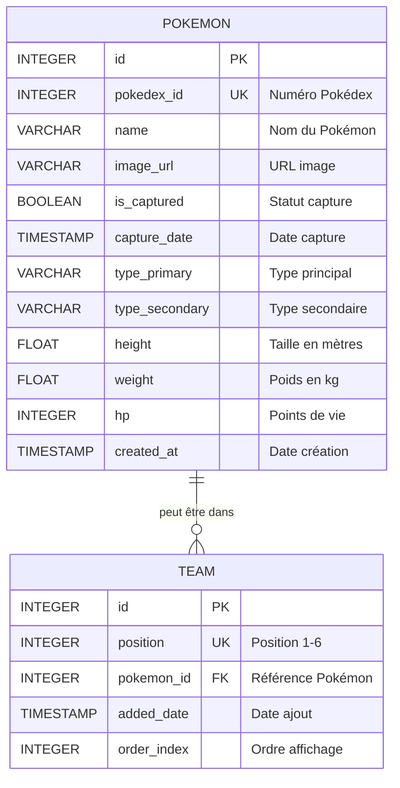

# 🎮 Pokédex Electron

<div align="center">
  
  **Une application de bureau complète pour capturer, gérer et collectionner vos Pokémons préférés**
  
  [](https://jestjs.io/)
  [](https://electronjs.org/)
  [](LICENSE)
</div>

---

## 📋 Table des matières

- [À propos](#à-propos)
- [Fonctionnalités](#fonctionnalités)
- [Architecture](#architecture)
- [Installation](#installation)
- [Utilisation](#utilisation)
- [Tests](#tests)
- [License](#license)

---

## 🎯 À propos

**Pokédex Electron** est une application de bureau moderne développée avec **Electron**, permettant aux fans de Pokémon de :
- 📚 Consulter un Pokédex complet avec tous les Pokémons
- 🎯 Capturer des Pokémons via un système de clicker intuitif
- ⚔️ Constituer une équipe stratégique de 6 Pokémons
- 💾 Sauvegarder localement toutes leurs données

---

## ✨ Fonctionnalités

### 🗂️ Pokédex Complet
- Visualisation de **tous les Pokémons** disponibles
- Filtrage par statut (capturé / non capturé)
- Fiche détaillée avec statistiques, types, poids et taille
- Interface responsive et moderne

### 🎯 Système de Capture
- **Mode clicker** : cliquez pour infliger des dégâts
- Système de **PV basé sur les stats réelles** des Pokémons
- **Coups critiques** (3% de chance) avec effet d'éclair
- **Pokéball rare** (10% de chance) pour capture instantanée
- Animation fluide de capture

### ⚔️ Gestion d'Équipe
- Constitution d'une **équipe de 6 Pokémons**
- **Drag & Drop** intuitif pour organiser l'équipe
- Bonus de dégâts : **+1 dégât par Pokémon en équipe**
- Sauvegarde automatique avec confirmation

### 💾 Persistance Locale
- Base de données **SQLite** embarquée
- Synchronisation avec **PokéAPI**
- Sauvegarde automatique de la progression
- Gestion robuste des erreurs

---

## 🏗️ Architecture

### Architecture Multi-Processus

```
┌─────────────────────────────────────────────────────────┐
│                    MAIN PROCESS                          │
│  ┌────────────────────────────────────────────────┐     │
│  │  main.js                                        │     │
│  │  - Création de la fenêtre                       │     │
│  │  - Gestion du cycle de vie                      │     │
│  │  - IPC Handlers                                 │     │
│  └──────────────┬──────────────────────────────────┘     │
│                 │                                          │
│  ┌──────────────▼──────────────┐  ┌─────────────────┐    │
│  │  database.js                 │  │  api-service.js │    │
│  │  - CRUD Operations           │  │  - PokéAPI      │    │
│  │  - SQLite3                   │  │  - Fetch        │    │
│  └──────────────────────────────┘  └─────────────────┘    │
└─────────────────────┬───────────────────────────────────┘
                      │ IPC (contextBridge)
                      │
┌─────────────────────▼───────────────────────────────────┐
│                 PRELOAD SCRIPT                           │
│  ┌────────────────────────────────────────────────┐     │
│  │  preload.js                                     │     │
│  │  - contextBridge.exposeInMainWorld()            │     │
│  │  - API sécurisée exposée au renderer            │     │
│  │  - Validation des paramètres                    │     │
│  └────────────────────────────────────────────────┘     │
└─────────────────────┬───────────────────────────────────┘
                      │
┌─────────────────────▼───────────────────────────────────┐
│                 RENDERER PROCESS                         │
│  ┌────────────────────────────────────────────────┐     │
│  │  index.html + styles.css                        │     │
│  │  ┌──────────┐  ┌──────────┐  ┌──────────┐      │     │
│  │  │ home.js  │  │pokedex.js│  │capture.js│      │     │
│  │  └──────────┘  └──────────┘  └──────────┘      │     │
│  │  ┌──────────┐  ┌──────────────────────┐        │     │
│  │  │ team.js  │  │  renderer.js         │        │     │
│  │  └──────────┘  └──────────────────────┘        │     │
│  └────────────────────────────────────────────────┘     │
└─────────────────────────────────────────────────────────┘
```

### Organisation des fichiers

```
Pokedex/
├── src/
│   ├── main/
│   │   ├── main.js           # Point d'entrée, création fenêtre
│   │   ├── database.js       # Gestion SQLite
│   │   └── api-service.js    # Communication avec PokéAPI
│   ├── preload.js            # Bridge sécurisé Main ↔ Renderer
│   ├── renderer/
│   │   ├── index.html        # Interface principale
│   │   ├── css/
│   │   │   └── styles.css    # Styles globaux
│   │   └── js/
│   │       ├── renderer.js   # Logique globale
│   │       ├── home.js       # Page d'accueil
│   │       ├── pokedex.js    # Pokédex
│   │       ├── team.js       # Gestion équipe
│   │       └── capture.js    # Système de capture
│   └── assets/               # Images et ressources
├── tests/                    # Tests Jest
├── docs/                     # Documentation technique
├── .github/workflows/        # CI/CD GitHub Actions
└── package.json
```

### 📊 Schéma de Base de Données

L'application utilise **SQLite** comme base de données relationnelle embarquée pour stocker les Pokémons et la composition de l'équipe.

**Localisation** : `%AppData%/pokedex-electron/pokedex.db`



**Relations** :
- Un Pokémon peut être dans l'équipe (0 ou 1 fois)
- Une position de l'équipe contient 0 ou 1 Pokémon
- L'équipe est limitée à 6 positions maximum


---

## 🚀 Installation

### Prérequis

- **Node.js** >= 18.x
- **npm** >= 9.x
- **Git**

### Installation des dépendances

```bash
# Cloner le repository
git clone https://github.com/votre-username/pokedex-electron.git
cd pokedex-electron

# Installer les dépendances
npm install
```

---

## 💻 Utilisation

### Mode Développement

```bash
npm start
```

### Lancer les tests

```bash
npm test
```

### Build de production

```bash
# Build pour Windows
npm run build:win

# Build pour macOS
npm run build:mac

# Build pour Linux
npm run build:linux

# Build pour toutes les plateformes
npm run build
```

Les exécutables seront générés dans le dossier `dist/`.


---

## 🧪 Tests

### Lancer les tests

```bash
# Tests unitaires
npm test

# Tests en mode watch
npm run test:watch

# Coverage
npm run test:coverage
```

### Structure des tests

```
tests/
├── api-service.test.js    # Tests du service API
├── database.test.js       # Tests de la base de données
└── ...
```
---

## 📄 License

Ce projet est sous licence **MIT**. Voir le fichier [LICENSE](LICENSE) pour plus de détails.

---


<div align="center">
  Fait avec ❤️ pour les fans de Pokémon
</div>

