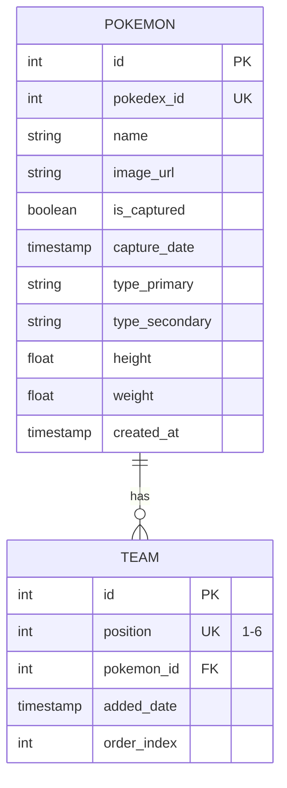

# Modèles de données - Pokedex Electron

## Vue d'ensemble

Ce document décrit les entités principales de l'application et leurs relations dans la base de données SQLite.

---

## Entités principales

### 1. Entité: Pokemon

Représente un Pokémon du Pokédex avec ses informations et statut de capture.

#### Attributs

| Attribut | Type | Contraintes | Description |
|----------|------|-------------|-------------|
| `id` | INTEGER | PRIMARY KEY, NOT NULL | Identifiant unique du Pokémon |
| `pokedex_id` | INTEGER | UNIQUE, NOT NULL | Numéro du Pokédex (1-1025) |
| `name` | VARCHAR(100) | NOT NULL | Nom du Pokémon |
| `image_url` | VARCHAR(255) | NOT NULL | URL de l'image du Pokémon |
| `is_captured` | BOOLEAN | NOT NULL, DEFAULT 0 | Indique si le Pokémon est capturé |
| `capture_date` | TIMESTAMP | DEFAULT CURRENT_TIMESTAMP | Date et heure de la capture |
| `type_primary` | VARCHAR(50) | Type principal du Pokémon |
| `type_secondary` | VARCHAR(50) | Type secondaire du Pokémon |
| `height` | FLOAT | Hauteur du Pokémon (en décimètres) |
| `weight` | FLOAT | Poids du Pokémon (en hectogrammes) |
| `created_at` | TIMESTAMP | DEFAULT CURRENT_TIMESTAMP | Date de création du record |

---

### 2. Entité: Team

Représente l'équipe personnalisée de l'utilisateur (6 Pokémons maximum).

#### Attributs

| Attribut | Type | Contraintes | Description |
|----------|------|-------------|-------------|
| `id` | INTEGER | PRIMARY KEY, NOT NULL | Identifiant unique du slot d'équipe |
| `position` | INTEGER | NOT NULL, UNIQUE | Position dans l'équipe (1-6) |
| `pokemon_id` | INTEGER | FOREIGN KEY | Référence à la table Pokemon |
| `added_date` | TIMESTAMP | DEFAULT CURRENT_TIMESTAMP | Date d'ajout à l'équipe |
| `order_index` | INTEGER | Ordre de sélection (pour tri) |

#### Relations

- **Team.pokemon_id** → **Pokemon.id** (FOREIGN KEY)
  - Relation: Un Team a un Pokemon
  - Cardinalité: Many-to-One
  - Action de suppression: ON DELETE SET NULL

---

## Diagramme UML - Modèle Entité-Relation

```
┌──────────────────────────────────┐
│          Pokemon                 │
├──────────────────────────────────┤
│ id (PK)                          │
│ pokedex_id (UNIQUE)              │
│ name                             │
│ image_url                        │
│ is_captured                      │
│ capture_date                     │
│ type_primary                     │
│ type_secondary                   │
│ height                           │
│ weight                           │
│ created_at                       │
└──────────────────────────────────┘
           ▲
           │ 1
           │
        has
           │
           │ *
           │
┌──────────────────────────────────┐
│          Team                    │
├──────────────────────────────────┤
│ id (PK)                          │
│ position (1-6, UNIQUE)           │
│ pokemon_id (FK)                  │
│ added_date                       │
│ order_index                      │
└──────────────────────────────────┘
```

---

## Diagramme Mermaid



---

## Schéma SQL

### Table: pokemon

```sql
CREATE TABLE pokemon (
    id INTEGER PRIMARY KEY AUTOINCREMENT,
    pokedex_id INTEGER UNIQUE NOT NULL,
    name VARCHAR(100) NOT NULL,
    image_url VARCHAR(255) NOT NULL,
    is_captured BOOLEAN NOT NULL DEFAULT 0,
    capture_date TIMESTAMP,
    type_primary VARCHAR(50),
    type_secondary VARCHAR(50),
    height FLOAT,
    weight FLOAT,
    created_at TIMESTAMP DEFAULT CURRENT_TIMESTAMP
);

CREATE INDEX idx_pokemon_name ON pokemon(name);
CREATE INDEX idx_pokemon_is_captured ON pokemon(is_captured);
CREATE INDEX idx_pokemon_pokedex_id ON pokemon(pokedex_id);
```

### Table: team

```sql
CREATE TABLE team (
    id INTEGER PRIMARY KEY AUTOINCREMENT,
    position INTEGER UNIQUE NOT NULL CHECK (position BETWEEN 1 AND 6),
    pokemon_id INTEGER REFERENCES pokemon(id) ON DELETE SET NULL,
    added_date TIMESTAMP DEFAULT CURRENT_TIMESTAMP,
    order_index INTEGER
);

CREATE INDEX idx_team_position ON team(position);
CREATE INDEX idx_team_pokemon_id ON team(pokemon_id);
```

---

## Intégrité des données

### Contraintes

1. **Pokemon**
   - `pokedex_id` est unique (chaque Pokémon n'existe qu'une fois)
   - `is_captured` est booléen (0 ou 1)
   - `image_url` est obligatoire pour affichage

2. **Team**
   - `position` est unique et entre 1 et 6 (une équipe = 6 slots max)
   - `pokemon_id` peut être NULL si un Pokémon est retiré
   - Un Pokémon peut être dans un seul slot de l'équipe à la fois

### Triggers (optionnels mais recommandés)

```sql
-- Trigger: Empêcher les doublons dans l'équipe
CREATE TRIGGER prevent_duplicate_pokemon
BEFORE INSERT ON team
BEGIN
    SELECT CASE WHEN 
        (SELECT COUNT(*) FROM team WHERE pokemon_id = NEW.pokemon_id) > 0
    THEN RAISE(ABORT, 'Pokemon already in team')
    END;
END;

-- Trigger: Mettre à jour la capture_date lors d'une capture
CREATE TRIGGER update_capture_date
AFTER UPDATE OF is_captured ON pokemon
WHEN NEW.is_captured = 1
BEGIN
    UPDATE pokemon SET capture_date = CURRENT_TIMESTAMP
    WHERE id = NEW.id;
END;
```

---

## Flux de données

### Flux de capture

```
Clic utilisateur
    ↓
Pokémon détecté
    ↓
Mise à jour: Pokemon.is_captured = 1
    ↓
Insertion capture_date
    ↓
Pokédex mis à jour (affichage)
    ↓
Pokémon maintenant sélectionnable pour l'équipe
```

### Flux de formation d'équipe

```
Sélection d'un Pokémon capturé
    ↓
Drag-and-drop dans un slot (1-6)
    ↓
Insertion/Mise à jour dans Team table
    ↓
Vérification: position unique (1-6)
    ↓
Vérification: pas de doublons
    ↓
Équipe sauvegardée
    ↓
Affichage: Team.position avec Team.pokemon_id
```

---

## Exemple de données

### Exemple table `pokemon`

| id | pokedex_id | name | image_url | is_captured | capture_date | type_primary | type_secondary |
|----|-----------|------|-----------|-------------|--------------|--------------|-----------------|
| 1 | 1 | Bulbasaur | https://...svg | 1 | 2024-12-09 14:30:00 | grass | poison |
| 2 | 2 | Ivysaur | https://...svg | 0 | NULL | grass | poison |
| 3 | 4 | Charmander | https://...svg | 1 | 2024-12-09 15:45:00 | fire | NULL |

### Exemple table `team`

| id | position | pokemon_id | added_date | order_index |
|----|----------|-----------|-----------|-------------|
| 1 | 1 | 1 | 2024-12-09 16:00:00 | 1 |
| 2 | 2 | 3 | 2024-12-09 16:05:00 | 2 |
| 3 | 3 | NULL | 2024-12-09 16:00:00 | NULL |

---

## Stratégies d'optimisation

### Indexation

- Index sur `name` pour recherches rapides
- Index sur `is_captured` pour filtrage Pokédex
- Index sur `pokedex_id` pour recherches par numéro
- Index sur `pokemon_id` dans team pour jointures

### Requêtes fréquentes

```sql
-- Récupérer tous les Pokémons capturés
SELECT * FROM pokemon WHERE is_captured = 1 ORDER BY name;

-- Récupérer l'équipe complète avec détails
SELECT t.position, p.* FROM team t
LEFT JOIN pokemon p ON t.pokemon_id = p.id
ORDER BY t.position;

-- Compter les captures
SELECT COUNT(*) FROM pokemon WHERE is_captured = 1;

-- Vérifier si un Pokémon est en équipe
SELECT * FROM team WHERE pokemon_id = ?;
```

---

## Migration et initialisation

### Création initiale

```javascript
const initializeDatabase = (db) => {
  db.exec(`
    CREATE TABLE IF NOT EXISTS pokemon (
      id INTEGER PRIMARY KEY AUTOINCREMENT,
      pokedex_id INTEGER UNIQUE NOT NULL,
      name VARCHAR(100) NOT NULL,
      image_url VARCHAR(255) NOT NULL,
      is_captured BOOLEAN NOT NULL DEFAULT 0,
      capture_date TIMESTAMP,
      type_primary VARCHAR(50),
      type_secondary VARCHAR(50),
      height FLOAT,
      weight FLOAT,
      created_at TIMESTAMP DEFAULT CURRENT_TIMESTAMP
    );

    CREATE TABLE IF NOT EXISTS team (
      id INTEGER PRIMARY KEY AUTOINCREMENT,
      position INTEGER UNIQUE NOT NULL CHECK (position BETWEEN 1 AND 6),
      pokemon_id INTEGER REFERENCES pokemon(id) ON DELETE SET NULL,
      added_date TIMESTAMP DEFAULT CURRENT_TIMESTAMP,
      order_index INTEGER
    );
  `);
};
```

### Seed avec PokéAPI

Lors du premier lancement, l'application:
1. Récupère les 151 premiers Pokémons depuis PokéAPI
2. Les insère dans la table `pokemon` avec `is_captured = 0`
3. Crée 6 slots vides dans la table `team`

